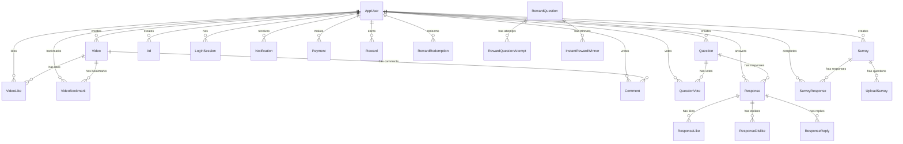

# Data Model Reference

Complete reference for the PostgreSQL database managed via Prisma ORM.

## Table of Contents

- [Entity Relationship Diagram](#entity-relationship-diagram)
- [Enums](#enums)
- [Core Models](#core-models)
- [Authentication Models](#authentication-models)
- [Content Models](#content-models)
- [Reward Models](#reward-models)
- [Payment Models](#payment-models)
- [Advertising Models](#advertising-models)
- [Notification Models](#notification-models)
- [Real-Time Models](#real-time-models)
- [Key Constraints](#key-constraints)

## Entity Relationship Diagram



## Enums

```prisma
enum PaymentStatus {
  PENDING
  SUCCESSFUL
  FAILED
}

enum SubscriptionStatus {
  ACTIVE
  INACTIVE
  PENDING
}

enum SubscriptionType {
  ONCE
  DAILY
  WEEKLY
  MONTHLY
  QUARTERLY
  HALF_YEARLY
  YEARLY
  LIFETIME
}

enum UserRole {
  USER
  ADMIN
  MODERATOR
}

enum NotificationType {
  PAYMENT_SUCCESS
  PAYMENT_FAILED
  PAYMENT_PENDING
  REWARD_EARNED
  REWARD_REDEEMED
  SURVEY_COMPLETED
  SURVEY_EXPIRING
  SUBSCRIPTION_ACTIVE
  SUBSCRIPTION_EXPIRED
  SECURITY_ALERT
  SYSTEM_UPDATE
  PROMOTIONAL
  ACHIEVEMENT
  REFERRAL_BONUS
  WELCOME
}

enum NotificationPriority {
  LOW
  MEDIUM
  HIGH
  URGENT
}
```

## Core Models

### AppUser

The central user model. All content and transactions reference this.

| Field | Type | Notes |
|-------|------|-------|
| id | UUID | Primary key |
| email | String | Unique |
| password | String | bcrypt hash (salt 10) |
| firstName | String | |
| lastName | String | |
| phone | String | |
| points | Int | Default: 0. Earned via rewards |
| avatar | String? | URL, default: pixabay placeholder |
| role | UserRole | Default: USER |
| twoFactorEnabled | Boolean | Default: false |
| twoFactorCode | String? | SHA-256 hashed OTP |
| twoFactorCodeExpiry | DateTime? | |
| twoFactorAttempts | Int | Default: 0. Max 5 before lockout |
| twoFactorLockedUntil | DateTime? | 15-minute lockout |
| passwordResetToken | String? | SHA-256 hashed |
| passwordResetExpiry | DateTime? | 1-hour expiry |
| subscriptionStatus | SubscriptionStatus | Default: INACTIVE |
| surveysubscriptionStatus | SubscriptionStatus | Default: INACTIVE |
| currentSubscriptionId | String? | |
| privacySettings | Json? | User visibility preferences |
| createdAt | DateTime | Auto-set |
| updatedAt | DateTime | Auto-updated |

**Relations:** Video, Comment, Question, QuestionVote, Response, ResponseLike, ResponseDislike, ResponseReply, Survey, SurveyResponse, LoginSession, Notification, Payment, Reward, RewardRedemption, RewardQuestion, QuestionAttempt, InstantRewardWinner, Ad, VideoLike, VideoBookmark, UploadQuestion, UploadSurvey

## Authentication Models

### LoginSession

Tracks active user sessions for multi-device management.

| Field | Type | Notes |
|-------|------|-------|
| id | UUID | Primary key |
| userId | UUID | FK → AppUser |
| deviceInfo | Json? | Platform, browser, OS |
| ipAddress | String? | |
| userAgent | String? | |
| location | String? | |
| isActive | Boolean | Default: true |
| lastActivity | DateTime | |
| loginTime | DateTime | |
| logoutTime | DateTime? | |
| sessionToken | String? | Current access token |
| refreshTokenHash | String? | SHA-256 of refresh token |
| refreshTokenExpiresAt | DateTime? | 30-day expiry |
| tokenFamily | UUID? | Detects token reuse |

**Indexes:** `[userId, isActive, sessionToken, refreshTokenHash, tokenFamily]`

## Content Models

### Video

| Field | Type | Notes |
|-------|------|-------|
| id | UUID | Primary key |
| userId | UUID | FK → AppUser |
| title | String | |
| description | String? | |
| videoUrl | String | Public URL or R2 key |
| thumbnail | String | |
| likes | Int | Default: 0. Denormalized counter |
| views | Int | Default: 0. Denormalized counter |
| commentsCount | Int | Default: 0. Denormalized counter |
| duration | Int? | Seconds |
| r2VideoKey | String? | R2 object key |
| r2ThumbnailKey | String? | |
| videoMimeType | String? | e.g., video/mp4 |
| videoSizeBytes | BigInt? | |
| storageProvider | String | Default: "r2" |
| isProcessed | Boolean | Transcoding complete |
| processingStatus | String? | |

**Indexes:** `[userId, r2VideoKey]`

### VideoLike

| Field | Type | Notes |
|-------|------|-------|
| id | UUID | Primary key |
| userId | UUID | FK → AppUser |
| videoId | UUID | FK → Video |

**Unique:** `@@unique([userId, videoId])` — one like per user per video

### VideoBookmark

Same structure as VideoLike with `@@unique([userId, videoId])`.

### Comment

| Field | Type | Notes |
|-------|------|-------|
| id | UUID | Primary key |
| userId | UUID | FK → AppUser |
| videoId | UUID | FK → Video |
| text | String | |
| mediaUrls | String[] | Default: [] |

### Question

| Field | Type | Notes |
|-------|------|-------|
| id | UUID | Primary key |
| userId | UUID | FK → AppUser |
| text | String | |
| category | String | Default: "General" |
| rewardAmount | Float | Default: 0 |
| isInstantReward | Boolean | Default: false |
| viewCount | Int | Default: 0 |

**Indexes:** `[createdAt, isInstantReward]`

### QuestionVote

| Field | Type | Notes |
|-------|------|-------|
| id | UUID | Primary key |
| userId | UUID | FK → AppUser |
| questionId | UUID | FK → Question |
| type | String | "up" or "down" |

**Unique:** `@@unique([userId, questionId])`

### Response

Answers to questions.

| Field | Type | Notes |
|-------|------|-------|
| id | UUID | Primary key |
| userId | UUID | FK → AppUser |
| questionId | UUID | FK → Question |
| responseText | String | |

**Indexes:** `[userId, questionId]`, `[userId, createdAt]`, `[questionId]`

### ResponseLike / ResponseDislike

Both follow: `@@unique([userId, responseId])`

### ResponseReply

| Field | Type | Notes |
|-------|------|-------|
| id | UUID | Primary key |
| userId | UUID | FK → AppUser |
| responseId | UUID | FK → Response |
| replyText | String | |

### Survey

| Field | Type | Notes |
|-------|------|-------|
| id | UUID | Primary key |
| userId | UUID | FK → AppUser |
| title | String | |
| description | String? | |
| rewardAmount | Float | Default: 2000 (UGX) |
| maxResponses | Int? | Optional cap |
| startDate | DateTime | |
| endDate | DateTime | |

**Indexes:** `[userId, startDate, endDate, createdAt]`

### UploadSurvey

Survey questions (template rows).

| Field | Type | Notes |
|-------|------|-------|
| type | String | text, radio, checkbox, range, slider, rating |
| options | String | JSON array of choices |
| required | Boolean | Default: true |

### SurveyResponse

| Field | Type | Notes |
|-------|------|-------|
| userId | UUID | FK → AppUser |
| surveyId | UUID | FK → Survey |
| responses | String | JSON object of answers |

**Unique:** `@@unique([userId, surveyId])` — one attempt per user

### Livestream

| Field | Type | Notes |
|-------|------|-------|
| id | UUID | Primary key |
| userId | UUID | FK → AppUser |
| sessionId | String | Unique session identifier |
| streamKey | String | Unique auth key |
| status | String | pending, live, ended, failed |
| maxDurationSeconds | Int | Default: 300 (5 min) |
| viewerCount | Int | Current |
| peakViewerCount | Int | Maximum reached |
| r2RecordingKey | String? | Recording path in R2 |

## Reward Models

### RewardQuestion

Questions with guaranteed cash payouts.

| Field | Type | Notes |
|-------|------|-------|
| id | UUID | Primary key |
| userId | UUID | FK → AppUser (creator) |
| text | String | Question text |
| options | Json | JSON array of choices |
| correctAnswer | String | **Never exposed publicly** |
| rewardAmount | Int | UGX payout per winner |
| isActive | Boolean | Default: true |
| isInstantReward | Boolean | Auto-disburse on correct answer |
| maxWinners | Int | Default: 2 |
| winnersCount | Int | Default: 0. Incremented atomically |
| isCompleted | Boolean | All winners paid or expired |
| paymentProvider | String? | MTN or AIRTEL |
| phoneNumber | String? | **Never exposed publicly** |

**Security:** `formatRewardQuestionPublic()` strips `correctAnswer`, `phoneNumber`, `paymentProvider` from all API responses.

### RewardQuestionAttempt

| Field | Type | Notes |
|-------|------|-------|
| userEmail | String | Identifier |
| rewardQuestionId | UUID | FK → RewardQuestion |
| selectedAnswer | String | |
| isCorrect | Boolean | |

**Unique:** `@@unique([userEmail, rewardQuestionId])` — one attempt per user

### InstantRewardWinner

| Field | Type | Notes |
|-------|------|-------|
| rewardQuestionId | UUID | FK → RewardQuestion |
| userEmail | String | Winner's email |
| position | Int | 1st, 2nd, etc. |
| amountAwarded | Int | UGX |
| paymentStatus | PaymentStatus | Default: PENDING |
| paymentReference | String? | Transaction ID from provider |
| paymentProvider | String? | MTN or AIRTEL |

**Unique:** `@@unique([rewardQuestionId, userEmail])`

### QuestionAttempt

General question attempt tracking.

| Field | Type | Notes |
|-------|------|-------|
| userEmail | String | |
| questionId | UUID | FK → Question |
| selectedAnswer | String | |
| isCorrect | Boolean | |

**Unique:** `@@unique([userEmail, questionId])`

### Reward

Points earned by users.

| Field | Type | Notes |
|-------|------|-------|
| userEmail | String | FK (logical) → AppUser.email |
| points | Int | |
| description | String? | |

### RewardRedemption

Points-to-cash conversion records.

| Field | Type | Notes |
|-------|------|-------|
| id | UUID | Primary key |
| userId | UUID | FK → AppUser |
| cashValue | Int | UGX amount |
| provider | String | MTN or AIRTEL |
| phoneNumber | String | Payout destination |
| type | String | CASH or AIRTIME |
| status | PaymentStatus | Default: PENDING |
| transactionRef | String? | Provider reference |
| errorMessage | String? | Failure reason |
| requestedAt | DateTime | |
| completedAt | DateTime? | |

**Indexes:** `[userId, status]`, `[status]`

## Payment Models

### Payment

Subscription payments (user → platform).

| Field | Type | Notes |
|-------|------|-------|
| id | UUID | Primary key |
| userId | UUID | FK → AppUser |
| amount | Float | |
| phoneNumber | String | |
| provider | String | MTN or AIRTEL |
| TransactionId | String | Unique. Provider reference |
| status | PaymentStatus | |
| subscriptionType | SubscriptionType | |
| startDate | DateTime | |
| endDate | DateTime | |

**Indexes:** `[userId, status]`

## Advertising Models

### Ad

| Field | Type | Notes |
|-------|------|-------|
| id | UUID | Primary key |
| userId | UUID | FK → AppUser (advertiser) |
| title | String | |
| description | String | |
| headline | String | Short display text |
| imageUrl | String? | |
| videoUrl | String? | |
| thumbnailUrl | String? | |
| type | String | Default: "regular" (regular, featured, banner, compact) |
| placement | String | Default: "feed" (feed, survey, video, question, home, etc.) |
| sponsored | Boolean | Default: false |
| views / clicks / impressions / conversions | Int | Default: 0 each |
| isActive | Boolean | Default: true |
| targetUrl | String? | Click destination |
| callToAction | String | Default: "learn_more" |
| pricingModel | String | Default: "cpm" (cpm, cpc, cpa, flat) |
| totalBudget | Float | |
| bidAmount | Float | |
| dailyBudgetLimit | Float? | |
| amountSpent | Float | Default: 0 |
| targetAgeRanges | Json? | e.g., ["18-24", "25-34"] |
| targetGender | String | |
| targetLocations | Json? | |
| targetInterests | Json? | |
| status | String | Default: "pending" (pending, approved, rejected, paused, completed) |
| priority | Int | Default: 5 |
| frequency | Int? | Impression cap per user |
| r2ImageKey / r2VideoKey / r2ThumbnailKey | String? | R2 storage keys |

**Indexes:** `[userId, type, placement, isActive, priority, status, pricingModel, r2ImageKey, r2VideoKey]`

## Notification Models

### Notification

| Field | Type | Notes |
|-------|------|-------|
| id | UUID | Primary key |
| userId | UUID | FK → AppUser |
| title | String | |
| body | String | |
| type | NotificationType | |
| priority | NotificationPriority | Default: MEDIUM |
| icon | String? | |
| actionUrl | String? | Deep link target |
| actionText | String? | CTA label |
| metadata | Json? | |
| read | Boolean | Default: false |
| archived | Boolean | Default: false |
| delivered | Boolean | Default: false |
| expiresAt | DateTime? | Auto-cleanup |

**Indexes:** `[userId, read, createdAt]`, `[userId, type]`, `[userId, priority]`, `[expiresAt]`

## Real-Time Models

### SSEEvent

Event queue for Server-Sent Events, with auto-cleanup.

| Field | Type | Notes |
|-------|------|-------|
| id | UUID | Primary key |
| seq | Int | Auto-increment. For resumption |
| userId | UUID | Target user |
| type | String | Event type (e.g., "notification.new") |
| payload | Json | Event data |
| createdAt | DateTime | 10-minute TTL |

**Indexes:** `[userId, seq]`, `[createdAt]`

## Key Constraints

### Unique Constraints (Deduplication)

| Model | Constraint | Purpose |
|-------|-----------|---------|
| VideoLike | `[userId, videoId]` | One like per user per video |
| VideoBookmark | `[userId, videoId]` | One bookmark per user per video |
| QuestionVote | `[userId, questionId]` | One vote per user per question |
| ResponseLike | `[userId, responseId]` | One like per user per response |
| ResponseDislike | `[userId, responseId]` | One dislike per user per response |
| SurveyResponse | `[userId, surveyId]` | One attempt per user per survey |
| RewardQuestionAttempt | `[userEmail, rewardQuestionId]` | One attempt per user per reward question |
| QuestionAttempt | `[userEmail, questionId]` | One attempt per user per question |
| InstantRewardWinner | `[rewardQuestionId, userEmail]` | One win per user per question |
| Payment | `TransactionId` | Unique payment reference |

### Denormalized Counters

| Model | Field | Maintained By |
|-------|-------|--------------|
| Video | likes | `$transaction` on like/unlike |
| Video | views | Increment on view |
| Video | commentsCount | Increment/decrement on comment CRUD |
| RewardQuestion | winnersCount | `$transaction` on winner allocation |
