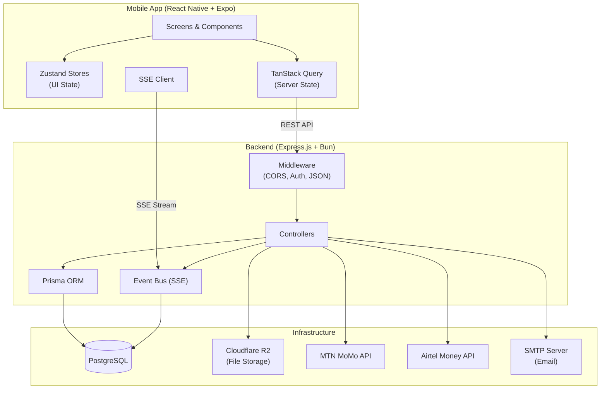
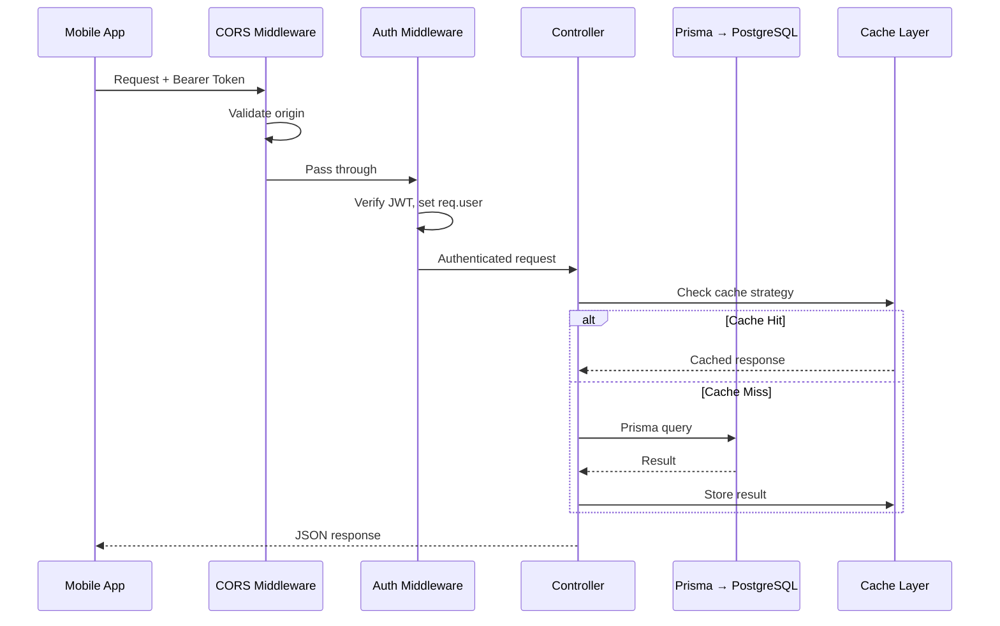
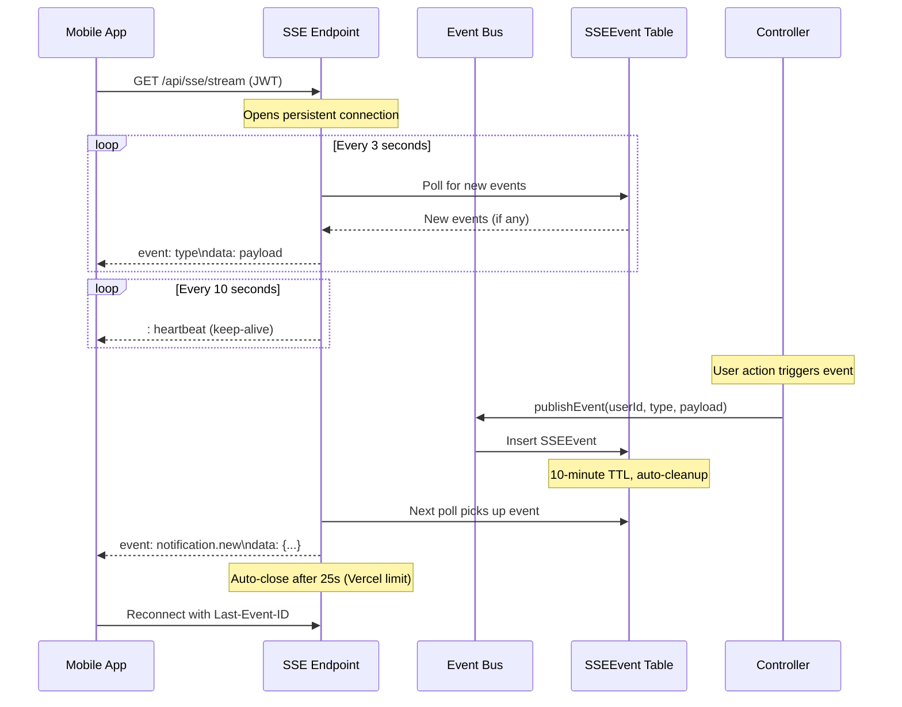
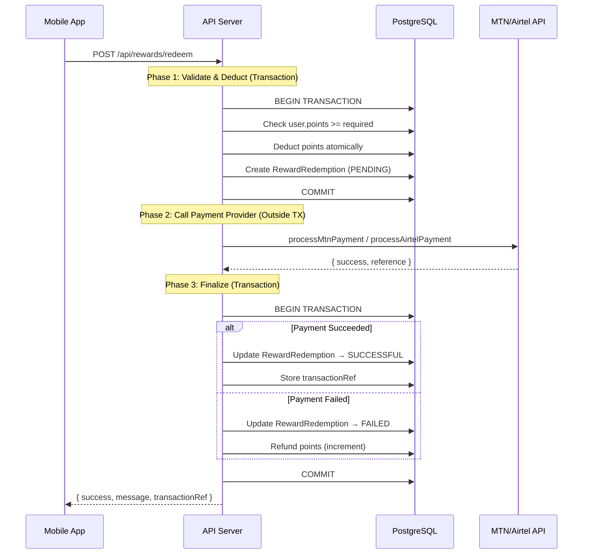

# System Architecture

## Table of Contents

- [High-Level Architecture](#high-level-architecture)
- [Request Flow](#request-flow)
- [Real-Time Events](#real-time-events)
- [Payment Flow](#payment-flow)
- [Key Architectural Principles](#key-architectural-principles)

## High-Level Architecture



## Request Flow

Every API request follows this pipeline:



### Middleware Chain

```text
Request → CORS → express.json() → cookieParser → [verifyToken] → Controller → Error Handler → Response
```

- **CORS** — Validates origin against allowlist (mobile apps with no origin are allowed)
- **express.json()** — Parses JSON request bodies
- **verifyToken** — Extracts JWT from `Authorization: Bearer <token>`, sets `req.user.id`
- **requireRole** — Optional role-based guard (`ADMIN`, `MODERATOR`)
- **optionalAuth** — Same as verifyToken but continues as anonymous on failure

## Real-Time Events

Server-Sent Events (SSE) deliver real-time updates to connected clients:



### Event Types

| Event | Trigger | Payload |
|-------|---------|---------|
| `notification.new` | New notification created | `{ id, title, body, type }` |
| `payment.success` | Payment completed | `{ amount, provider, reference }` |
| `payment.failed` | Payment failed | `{ error, refunded }` |
| `reward.earned` | User earned reward | `{ points, description }` |

## Payment Flow

The 3-phase transaction pattern ensures atomicity for reward redemptions:



### Why 3 Phases?

1. **Phase 1 (Transaction):** Points deducted atomically — prevents double-spending
2. **Phase 2 (No Transaction):** Payment API call outside DB transaction — avoids long-held locks during external network calls
3. **Phase 3 (Transaction):** Final status + refund on failure — guarantees consistency

## Key Architectural Principles

### State Separation

```text
┌─────────────────────────────────────────────┐
│                  Mobile App                  │
├──────────────┬──────────────┬───────────────┤
│   Zustand    │ TanStack     │  SecureStore   │
│   (UI State) │ Query        │  (Auth Tokens) │
│              │ (Server      │                │
│  Tabs, forms │  State)      │  accessToken   │
│  drafts, UI  │              │  refreshToken  │
│  preferences │  API data,   │                │
│              │  cache,      │  AsyncStorage   │
│  Persisted   │  background  │  (Preferences)  │
│  to          │  refetch     │                │
│  AsyncStorage│              │                │
└──────────────┴──────────────┴───────────────┘
```

### Optimistic Updates

Mutations update Zustand stores immediately, then sync with the server. On server failure, the optimistic state is rolled back:

```text
User taps Like → Zustand toggleLike() → UI updates instantly
                → likeVideoMutate() → Server request
                     ├─ onSuccess: confirmed
                     └─ onError: toggleLike() rollback
```

### Offline-First

Critical operations (reward submissions, uploads) are queued when offline:

```text
User submits answer → Online? → Yes → API call
                              → No  → addPendingSubmission()
                                       ↓
                              Network restored → useOfflineQueueProcessor
                                                 flushes queue
```

### Denormalized Counters

High-read fields use denormalized counters maintained via Prisma `$transaction`:

```text
Video.likes     — incremented/decremented on like/unlike
Video.views     — incremented on view
Video.commentsCount — incremented on comment create
RewardQuestion.winnersCount — incremented on winner allocation
```

This avoids expensive `COUNT(*)` queries on every read.
