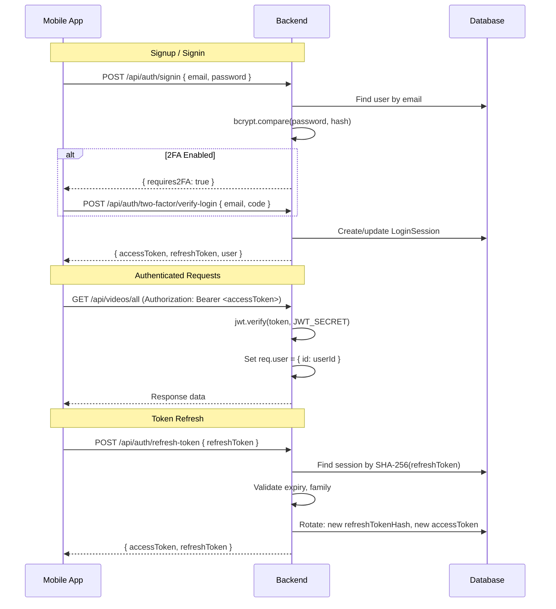
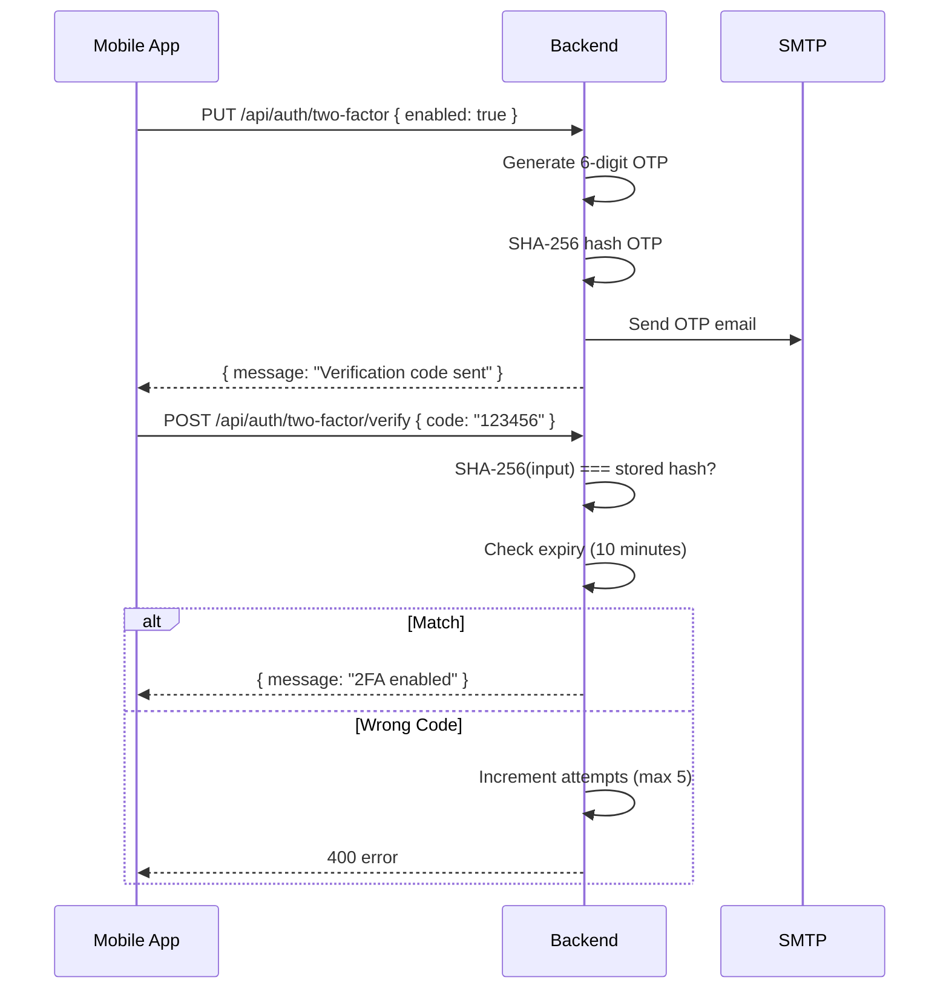
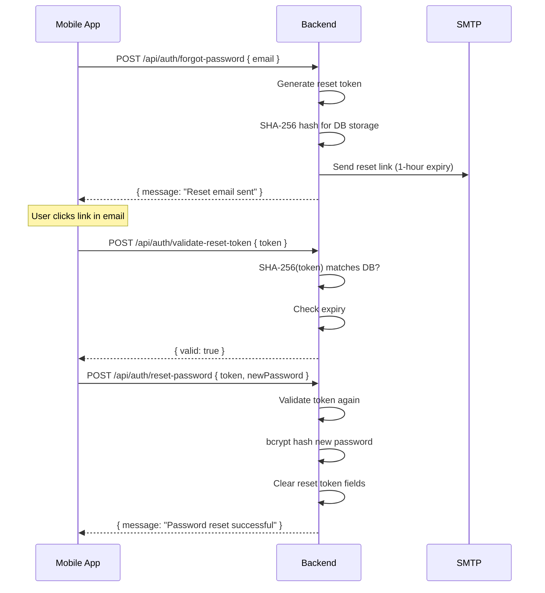

# Authentication System

## Table of Contents

- [Overview](#overview)
- [JWT Token Flow](#jwt-token-flow)
- [Token Rotation](#token-rotation)
- [Two-Factor Authentication](#two-factor-authentication)
- [Password Reset](#password-reset)
- [Session Management](#session-management)
- [Middleware Reference](#middleware-reference)

## Overview

DelipuCash uses JWT-based authentication with short-lived access tokens and long-lived refresh tokens. The system supports 2FA via email OTP and tracks login sessions for multi-device management.

| Component | Implementation |
|-----------|---------------|
| Access Token | JWT, 15-minute expiry |
| Refresh Token | 64-char hex string, 30-day expiry |
| Password Hash | bcrypt (salt rounds: 10) |
| 2FA | 6-digit OTP via email, SHA-256 stored |
| Token Storage | SHA-256 hashed in `LoginSession` table |
| Client Storage | SecureStore (encrypted, native keychain) |

## JWT Token Flow



### Access Token Claims

```json
{
  "id": "uuid-of-user",
  "iat": 1708000000,
  "exp": 1708000900
}
```

### Token Pair Issuance

On every signin or refresh, `issueTokenPair()` in `tokenUtils.mjs`:

1. Generates a new access token (JWT, 15m expiry)
2. Generates a new refresh token (64-char random hex)
3. SHA-256 hashes the refresh token for secure DB storage
4. Creates or updates `LoginSession` with device info, IP, user agent
5. Returns both tokens to the client

## Token Rotation

Each refresh token belongs to a **token family** (UUID). This enables detection of token reuse (theft):

```text
Normal flow:
  RT-1 → rotate → RT-2 → rotate → RT-3  (same family)

Reuse attack detected:
  RT-1 → rotate → RT-2 (legitimate)
  RT-1 → rotate → BLOCKED (RT-1 already used → invalidate entire family)
```

When reuse is detected, all sessions in that token family are invalidated, forcing re-authentication.

## Two-Factor Authentication

### Enable 2FA



### Brute-Force Protection

| Parameter | Value |
|-----------|-------|
| Max attempts | 5 |
| Lockout duration | 15 minutes |
| Code expiry | 10 minutes |
| Lockout field | `twoFactorLockedUntil` |
| Attempt counter | `twoFactorAttempts` (reset on success) |

### Login with 2FA

1. User submits email + password → `POST /api/auth/signin`
2. Server validates credentials, sees `twoFactorEnabled: true`
3. Returns `{ requires2FA: true }` (no tokens yet)
4. Client shows OTP input screen
5. User enters code → `POST /api/auth/two-factor/verify-login`
6. Server validates OTP → issues token pair

## Password Reset



## Session Management

### LoginSession Tracking

Every token pair issuance creates a `LoginSession` record with:

- Device info (platform, browser, OS parsed from User-Agent)
- IP address
- Location (if available)
- Login time, last activity
- Active status

### Multi-Device Operations

| Endpoint | Description |
|----------|-------------|
| `GET /api/users/login-activity` | List all sessions |
| `POST /api/users/sessions/:sessionId/revoke` | Revoke specific session |
| `POST /api/users/signout-all-devices` | Mark all sessions inactive |
| `POST /api/auth/signout` | Mark current session inactive |

## Middleware Reference

### `verifyToken`

**File:** `server/utils/verifyUser.mjs`

Extracts and verifies JWT from the `Authorization: Bearer <token>` header. Sets `req.user = { id }`.

| Scenario | Response |
|----------|----------|
| No header | 401 "You are not authenticated" |
| Expired token | 401 "Token expired" |
| Invalid/tampered | 403 "Token is not valid" |

### `requireRole(...roles)`

Checks `AppUser.role` from the database. Returns 403 if user's role is not in the allowed list.

```javascript
// Usage in routes
router.get('/admin/pending', verifyToken, requireModerator, getPendingAds);
router.delete('/cleanup', verifyToken, requireAdmin, cleanupNotifications);
```

### `optionalAuth`

Same as `verifyToken` but continues as anonymous (no `req.user`) if token is missing or invalid. Used for endpoints that enhance responses for authenticated users:

```javascript
// GET /api/videos/all — shows isLiked/isBookmarked if authenticated
router.get('/all', optionalAuth, getAllVideos);
```
