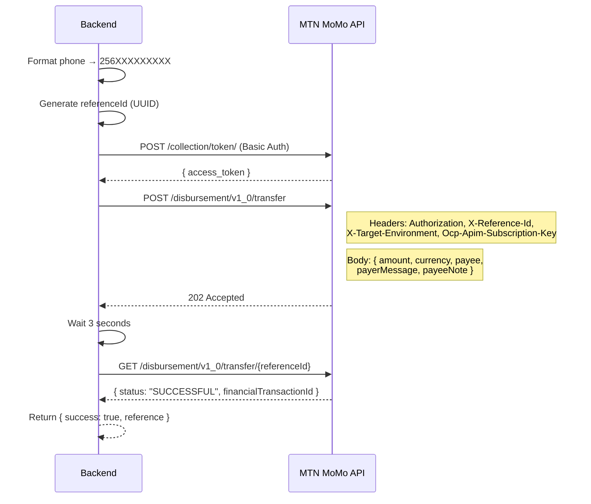
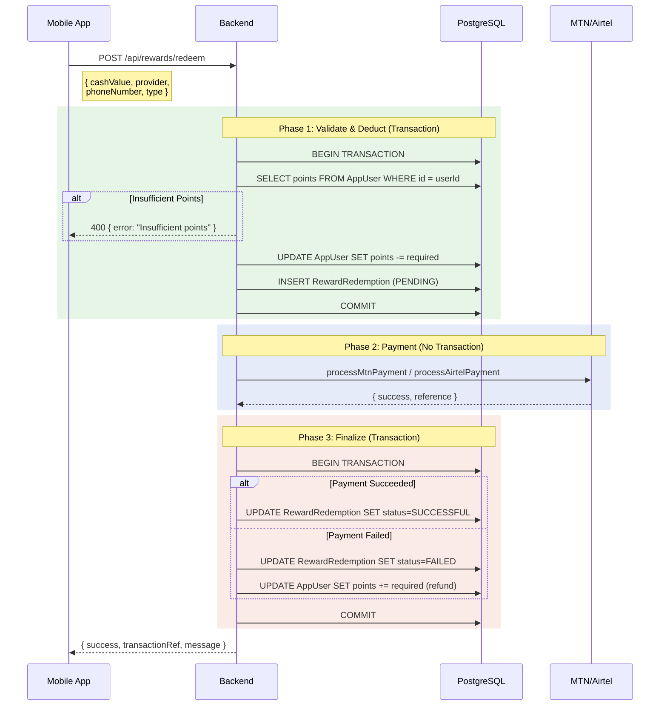

# Payment Integration

## Table of Contents

- [Overview](#overview)
- [MTN Mobile Money](#mtn-mobile-money)
- [Airtel Money](#airtel-money)
- [Reward Redemption Flow](#reward-redemption-flow)
- [Subscription Payments](#subscription-payments)
- [Error Handling](#error-handling)

## Overview

DelipuCash integrates with MTN MoMo and Airtel Money for two payment directions:

| Direction | Use Case | Controller |
|-----------|----------|-----------|
| **Platform → User** (Disbursement) | Reward payouts, instant rewards | `paymentController.mjs` |
| **User → Platform** (Collection) | Subscription payments | `surveyPaymentController.mjs` |

**Currency:** Uganda Shillings (UGX)

**Points Conversion:** 1 point = 100 UGX (`POINTS_TO_UGX = 100`)

## MTN Mobile Money

### Disbursement Flow

**Function:** `processMtnPayment({ amount, phoneNumber, userId, reason })`

### Configuration

| Env Variable | Purpose |
|-------------|---------|
| `MTN_PRIMARY_KEY` | API subscription key |
| `MTN_DISBURSEMENT_KEY` | Disbursement-specific key |

### API Endpoints

- **Token:** `https://sandbox.momodeveloper.mtn.com/collection/token/`
- **Transfer:** `https://sandbox.momodeveloper.mtn.com/disbursement/v1_0/transfer`
- **Status:** `https://sandbox.momodeveloper.mtn.com/disbursement/v1_0/transfer/{referenceId}`

> **Note:** Currently configured for MTN sandbox. Change base URL and remove EUR conversion for production.

## Airtel Money

### Disbursement Flow

**Function:** `processAirtelPayment({ amount, phoneNumber, userId, reason })`

Similar flow to MTN with Airtel-specific endpoints and authentication:

| Env Variable | Purpose |
|-------------|---------|
| `AIRTEL_CLIENT_ID` | OAuth client ID |
| `AIRTEL_CLIENT_SECRET` | OAuth client secret |

## Reward Redemption Flow

The `redeemRewards` controller uses a 3-phase transaction pattern for safe point-to-cash conversion:

### Request Validation

| Field | Validation |
|-------|-----------|
| `cashValue` | Required, positive number |
| `provider` | Required, must be "MTN" or "AIRTEL" |
| `phoneNumber` | Required |
| `type` | Required, must be "CASH" or "AIRTIME" |

### Instant Reward Disbursement

When a user correctly answers an instant reward question and the winner count reaches `maxWinners`:

1. `submitRewardQuestionAnswer` creates `InstantRewardWinner` record
2. Calls `processMtnPayment` or `processAirtelPayment` directly
3. Updates `InstantRewardWinner.paymentStatus` to SUCCESSFUL or FAILED
4. Publishes SSE event for real-time notification

## Subscription Payments

### Available Plans

Managed by `surveyPaymentController.mjs`:

| Endpoint | Description |
|----------|-------------|
| `GET /api/survey-subscriptions/plans` | List subscription tiers |
| `GET /api/survey-subscriptions/status` | Check current subscription |
| `POST /api/survey-payments/initiate` | Start payment |
| `GET /api/survey-payments/:paymentId/status` | Poll payment status |
| `POST /api/survey-subscriptions/:id/cancel` | Cancel auto-renewal |

### Subscription Types

ONCE, DAILY, WEEKLY, MONTHLY, QUARTERLY, HALF_YEARLY, YEARLY, LIFETIME

## Error Handling

### Payment Failures

- Phase 2 payment error → caught, `paymentResult.success = false`
- Phase 3 always runs → updates record status, refunds points on failure
- Client receives 502 with `"Payment processing failed. Your points have been refunded."`

### Idempotency

- Each `RewardRedemption` record has a unique ID
- Transaction phases prevent double-deduction
- Payment provider reference stored for reconciliation
