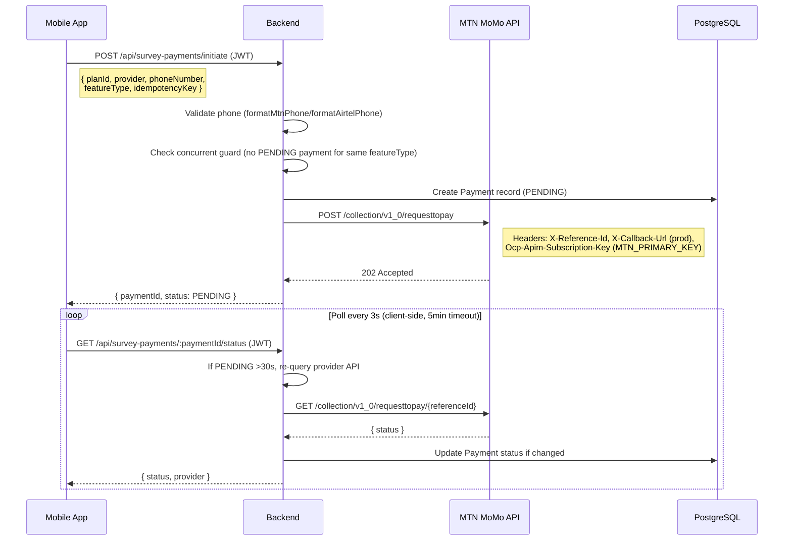
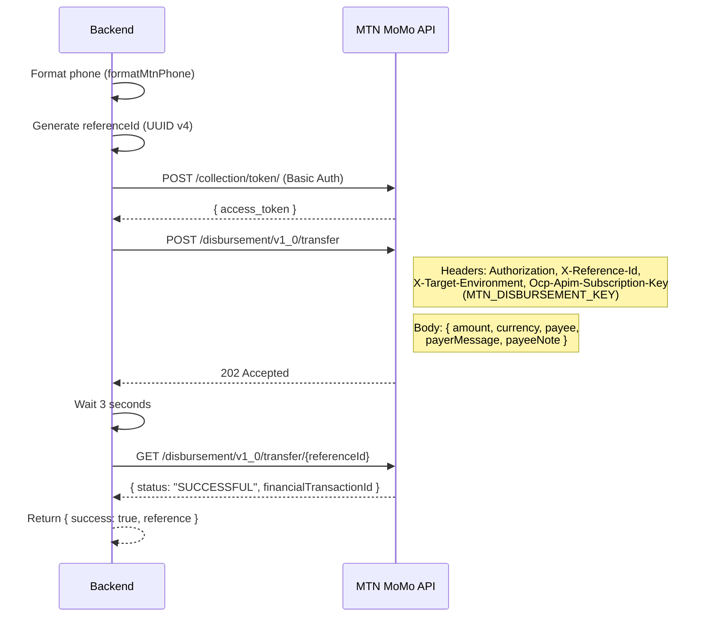
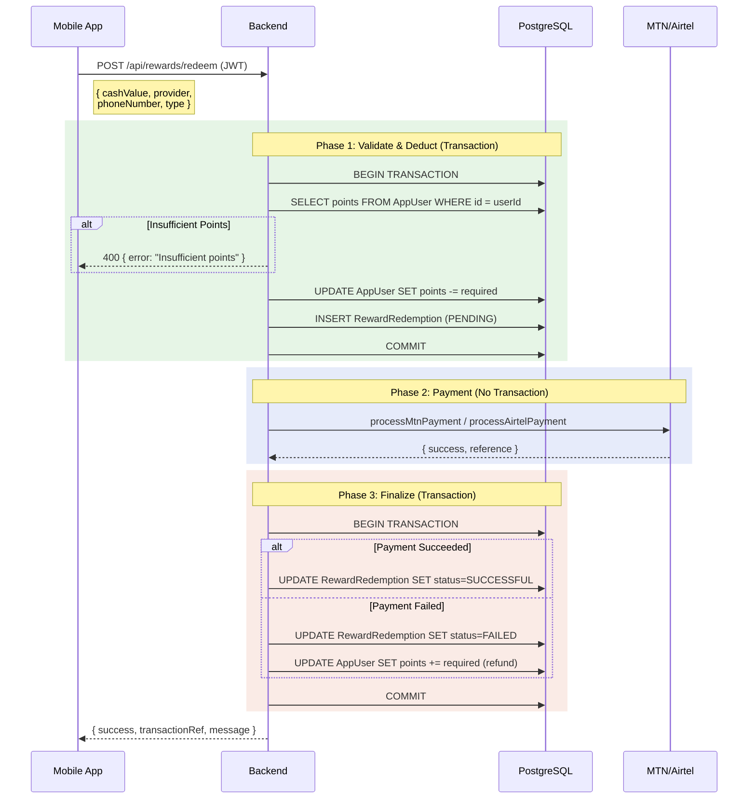

# Payment Integration

## Table of Contents

- [Overview](#overview)
- [Architecture — Provider Separation](#architecture--provider-separation)
- [MTN Mobile Money](#mtn-mobile-money)
- [Airtel Money](#airtel-money)
- [Collection Flow (User → Platform)](#collection-flow-user--platform)
- [Disbursement Flow (Platform → User)](#disbursement-flow-platform--user)
- [Reward Redemption Flow](#reward-redemption-flow)
- [Subscription Payments (Per-Feature)](#subscription-payments-per-feature)
- [Callback Verification](#callback-verification)
- [Phone Number Validation](#phone-number-validation)
- [Token Management](#token-management)
- [Security](#security)
- [Error Handling](#error-handling)
- [Environment Variables](#environment-variables)

## Overview

DelipuCash integrates with MTN MoMo and Airtel Money for two payment directions:

| Direction | Use Case | Config Module | Controller |
|-----------|----------|---------------|-----------|
| **User → Platform** (Collection) | Subscription payments | `mtnConfig.mjs` / `airtelConfig.mjs` | `surveyPaymentController.mjs` |
| **Platform → User** (Disbursement) | Reward payouts, instant rewards | `mtnConfig.mjs` / `airtelConfig.mjs` | `paymentController.mjs` |

**Currency:** Uganda Shillings (UGX) — sandbox uses EUR for MTN (auto-converted)

**Points Conversion:** 1 point = 100 UGX (`POINTS_TO_UGX = 100`)

## Architecture — Provider Separation

Each payment provider has a dedicated configuration module under `server/lib/`. The payment controller is a thin orchestrator that imports from both.

```text
server/lib/
├── mtnConfig.mjs        # MTN-only: base URL, token, phone formatter, headers, amount conversion
│                         # Also exports shared: tokenCache, EXPIRY_BUFFER_MS, isSandbox
└── airtelConfig.mjs     # Airtel-only: base URL, token, phone formatter, headers, status classification
                          # Imports shared cache from mtnConfig.mjs

server/controllers/
├── paymentController.mjs          # Thin orchestrator — imports from BOTH config modules
│                                   # Exports: processMtnPayment, processAirtelPayment,
│                                   # initiatePayment, initiateDisbursement, handleCallback,
│                                   # getPaymentHistory, updatePaymentStatus
└── surveyPaymentController.mjs    # Survey-specific: imports from paymentController only
                                    # Handles subscription initiation, polling, plan management
```

**Import rule:** Only `paymentController.mjs` imports from both config modules. All other controllers (`surveyPaymentController`, `surveyController`, `quizSessionController`) import from `paymentController` only.

### Shared Token Cache

Both providers share a single in-memory token cache exported from `mtnConfig.mjs`:

```javascript
// mtnConfig.mjs — shared exports
export const tokenCache = {};       // { 'mtn:collection': { token, expiresAt }, 'airtel': { token, expiresAt } }
export const EXPIRY_BUFFER_MS = 600_000;  // Refresh 10 min before expiry (MTN recommended)
export const isSandbox = MTN_TARGET_ENV === 'sandbox';

// airtelConfig.mjs — reuses the same cache
import { isSandbox, tokenCache, EXPIRY_BUFFER_MS } from './mtnConfig.mjs';
```

## MTN Mobile Money

### Configuration (`server/lib/mtnConfig.mjs`)

| Export | Purpose |
|--------|---------|
| `getMtnToken(product)` | OAuth token per product (`collection` / `disbursement`) with cache + thundering herd guard |
| `formatMtnPhone(phone)` | Normalize to `256XXXXXXXXX`, throws on invalid MSISDN |
| `getMtnHeaders(token, refId, product)` | Full header object including `X-Callback-Url` in production |
| `convertAmount(ugxAmount)` | UGX pass-through in production, EUR conversion in sandbox |
| `MTN_BASE_URL` | `sandbox.momodeveloper.mtn.com` or `proxy.momoapi.mtn.com` |
| `MTN_CURRENCY` | `EUR` (sandbox) or `UGX` (production) |
| `MTN_CALLBACK_URL` | Production callback URL (set via env) |

### MTN API Endpoints

| Environment | Base URL |
|-------------|----------|
| Sandbox | `https://sandbox.momodeveloper.mtn.com` |
| Production | `https://proxy.momoapi.mtn.com` |

| Operation | Method | Path |
|-----------|--------|------|
| Collection Token | POST | `/{product}/token/` |
| Request to Pay | POST | `/collection/v1_0/requesttopay` |
| Collection Status | GET | `/collection/v1_0/requesttopay/{referenceId}` |
| Disbursement Transfer | POST | `/disbursement/v1_0/transfer` |
| Disbursement Status | GET | `/disbursement/v1_0/transfer/{referenceId}` |

### MTN Subscription Keys

MTN uses separate subscription keys per product:

| Variable | Used For | Header |
|----------|----------|--------|
| `MTN_PRIMARY_KEY` | Collection (request-to-pay) | `Ocp-Apim-Subscription-Key` |
| `MTN_DISBURSEMENT_KEY` | Disbursement (transfer) | `Ocp-Apim-Subscription-Key` |

If `MTN_DISBURSEMENT_KEY` is not set, falls back to `MTN_PRIMARY_KEY`.

## Airtel Money

### Configuration (`server/lib/airtelConfig.mjs`)

| Export | Purpose |
|--------|---------|
| `getAirtelToken()` | OAuth token with cache + thundering herd guard |
| `formatAirtelPhone(phone)` | Normalize to E164_NO_PLUS (`2567XXXXXXXX`) or LOCAL (`7XXXXXXXX`) per `AIRTEL_MSISDN_FORMAT` env |
| `getAirtelHeaders(token)` | Header object with `X-Country` and `X-Currency` |
| `classifyAirtelStatus(apiResponse)` | Maps Airtel's inconsistent status codes to `SUCCESSFUL` / `FAILED` / `PENDING` |
| `extractAirtelStatusFields(apiResponse)` | Extracts `transactionId`, `message`, `rawStatus` from nested response |
| `pollAirtelStatus(transactionId)` | Polls Airtel status API with backoff (used by surveyPaymentController) |
| `AIRTEL_BASE_URL` | `openapiuat.airtel.africa` (sandbox) or `openapi.airtel.africa` (production) |

### Airtel Status Classification

Airtel returns inconsistent status shapes across endpoints. `classifyAirtelStatus` normalizes them:

```javascript
// Status constant Sets
const AIRTEL_SUCCESS_STATUSES = new Set(['TS', 'TIP', 'SUCCESS', 'SUCCESSFUL', 'S']);
const AIRTEL_FAILED_STATUSES  = new Set(['TF', 'TE', 'FAILED', 'ERROR', 'EXPIRED', 'CANCELLED', 'F', 'E']);
const AIRTEL_PENDING_STATUSES = new Set(['TIP', 'PENDING', 'INITIATED', 'IN_PROGRESS', 'P']);
```

### Airtel API Endpoints

| Environment | Base URL |
|-------------|----------|
| Sandbox | `https://openapiuat.airtel.africa` |
| Production | `https://openapi.airtel.africa` |

| Operation | Method | Path |
|-----------|--------|------|
| OAuth Token | POST | `/auth/oauth2/token` |
| Collection | POST | `/merchant/v1/payments/` |
| Collection Status | GET | `/standard/v1/payments/{transactionId}` |
| Disbursement | POST | `/standard/v1/disbursements/` |
| Disbursement Status | GET | `/standard/v1/disbursements/{transactionId}` |

## Collection Flow (User → Platform)

Used for subscription payments. Initiated via `surveyPaymentController.initiatePayment`.


```mermaid
sequenceDiagram
    participant App as Mobile App
    participant API as Backend
    participant MTN as MTN MoMo API
    participant DB as PostgreSQL

    App->>API: POST /api/survey-payments/initiate (JWT)
    Note right of App: { planId, provider, phoneNumber,<br/>featureType, idempotencyKey }

    API->>API: Validate phone (formatMtnPhone/formatAirtelPhone)
    API->>API: Check concurrent guard (no PENDING payment for same featureType)
    API->>DB: Create Payment record (PENDING)

    API->>MTN: POST /collection/v1_0/requesttopay
    Note right of MTN: Headers: X-Reference-Id, X-Callback-Url (prod),<br/>Ocp-Apim-Subscription-Key (MTN_PRIMARY_KEY)
    MTN-->>API: 202 Accepted

    API-->>App: { paymentId, status: PENDING }

    loop Poll every 3s (client-side, 5min timeout)
        App->>API: GET /api/survey-payments/:paymentId/status (JWT)
        API->>API: If PENDING >30s, re-query provider API
        API->>MTN: GET /collection/v1_0/requesttopay/{referenceId}
        MTN-->>API: { status }
        API->>DB: Update Payment status if changed
        API-->>App: { status, provider }
    end
```

### Idempotency

- Frontend generates an `idempotencyKey` per payment attempt (UUID)
- Stored as `@unique` on `Payment` model — duplicate initiation returns existing payment
- Key only rotates on `onSuccess`, not `onSettled` — failed attempts reuse the same key for dedup

### Concurrent Guard

Before creating a new payment, the controller checks for existing PENDING payments for the same `userId` + `featureType`. If found, returns 409 Conflict.

## Disbursement Flow (Platform → User)

Used for reward payouts and instant reward disbursements.


```mermaid
sequenceDiagram
    participant API as Backend
    participant MTN as MTN MoMo API

    API->>API: Format phone (formatMtnPhone)
    API->>API: Generate referenceId (UUID v4)
    API->>MTN: POST /collection/token/ (Basic Auth)
    MTN-->>API: { access_token }

    API->>MTN: POST /disbursement/v1_0/transfer
    Note right of MTN: Headers: Authorization, X-Reference-Id,<br/>X-Target-Environment, Ocp-Apim-Subscription-Key<br/>(MTN_DISBURSEMENT_KEY)
    Note right of MTN: Body: { amount, currency, payee,<br/>payerMessage, payeeNote }
    MTN-->>API: 202 Accepted

    API->>API: Wait 3 seconds

    API->>MTN: GET /disbursement/v1_0/transfer/{referenceId}
    MTN-->>API: { status: "SUCCESSFUL", financialTransactionId }

    API-->>API: Return { success: true, reference }
```

## Reward Redemption Flow

The `redeemRewards` controller uses a 3-phase transaction pattern for safe point-to-cash conversion:


```mermaid
sequenceDiagram
    participant App as Mobile App
    participant API as Backend
    participant DB as PostgreSQL
    participant Pay as MTN/Airtel

    App->>API: POST /api/rewards/redeem (JWT)
    Note right of App: { cashValue, provider,<br/>phoneNumber, type }

    rect rgb(230, 245, 230)
        Note over API,DB: Phase 1: Validate & Deduct (Transaction)
        API->>DB: BEGIN TRANSACTION
        API->>DB: SELECT points FROM AppUser WHERE id = userId
        alt Insufficient Points
            API-->>App: 400 { error: "Insufficient points" }
        end
        API->>DB: UPDATE AppUser SET points -= required
        API->>DB: INSERT RewardRedemption (PENDING)
        API->>DB: COMMIT
    end

    rect rgb(230, 235, 250)
        Note over API,Pay: Phase 2: Payment (No Transaction)
        API->>Pay: processMtnPayment / processAirtelPayment
        Pay-->>API: { success, reference }
    end

    rect rgb(250, 235, 230)
        Note over API,DB: Phase 3: Finalize (Transaction)
        API->>DB: BEGIN TRANSACTION
        alt Payment Succeeded
            API->>DB: UPDATE RewardRedemption SET status=SUCCESSFUL
        else Payment Failed
            API->>DB: UPDATE RewardRedemption SET status=FAILED
            API->>DB: UPDATE AppUser SET points += required (refund)
        end
        API->>DB: COMMIT
    end

    API-->>App: { success, transactionRef, message }
```

### Request Validation

| Field | Validation |
|-------|-----------|
| `cashValue` | Required, positive number |
| `provider` | Required, must be "MTN" or "AIRTEL" |
| `phoneNumber` | Required, validated by provider-specific formatter |
| `type` | Required, must be "CASH" or "AIRTIME" |

### Instant Reward Disbursement

When a user correctly answers an instant reward question and the winner count reaches `maxWinners`:

1. `submitRewardQuestionAnswer` creates `InstantRewardWinner` record
2. Calls `processInstantRewardPayment` with **automatic retry** (3 attempts, exponential backoff)
3. Updates `InstantRewardWinner.paymentStatus` to SUCCESSFUL or FAILED
4. Publishes SSE event for real-time notification

#### Payment Retry Logic

```text
Attempt 1 → processPayment()
  ├─ Success → paymentStatus = SUCCESSFUL, done
  └─ Failure → wait 1s
Attempt 2 → processPayment()
  ├─ Success → paymentStatus = SUCCESSFUL, done
  └─ Failure → wait 2s
Attempt 3 → processPayment()
  ├─ Success → paymentStatus = SUCCESSFUL, done
  └─ Failure → paymentStatus = FAILED (all retries exhausted)
```

| Parameter | Value |
|-----------|-------|
| Max retries | 3 |
| Backoff strategy | Exponential (1s, 2s, 4s) |
| Retries on | Payment failure and transient errors |
| Final state | FAILED only after all retries exhausted |

## Subscription Payments (Per-Feature)

### Feature Types

Subscriptions are sold independently per feature:

| Feature Type | Plans Array | DB Filter |
|-------------|-------------|-----------|
| `SURVEY` | `SURVEY_SUBSCRIPTION_PLANS` | `featureType: 'SURVEY'` |
| `VIDEO` | `VIDEO_SUBSCRIPTION_PLANS` | `featureType: 'VIDEO'` |

### Subscription Types

ONCE, DAILY, WEEKLY, MONTHLY, QUARTERLY, HALF_YEARLY, YEARLY, LIFETIME

### Key Endpoints

| Endpoint | Auth | Description |
|----------|------|-------------|
| `GET /api/survey-subscriptions/plans?featureType=` | - | List plans for a feature |
| `GET /api/survey-subscriptions/status` | JWT | Current subscription status |
| `POST /api/survey-payments/initiate` | JWT | Start payment (includes `featureType` in body) |
| `GET /api/survey-payments/:paymentId/status` | JWT | Poll payment status |
| `GET /api/survey-payments/unified-status` | JWT | Per-feature status: `{ survey: {...}, video: {...} }` |
| `POST /api/survey-payments/cleanup-stale` | Admin | Mark stale PENDING payments as FAILED |

### Subscription Status Query

`getSubscriptionStatus` filters by both `featureType` and active `endDate`:

```javascript
const latestPayment = await prisma.payment.findFirst({
  where: {
    userId,
    status: 'SUCCESSFUL',
    featureType: 'SURVEY',      // Per-feature filter
    endDate: { gt: new Date() }, // Only active subscriptions
  },
  orderBy: { endDate: 'desc' },
});
```

### Backward Compatibility

- Legacy `PREMIUM` entitlement from Google Play grants both features
- Old payments without `featureType` default to `SURVEY`

## Callback Verification

Production callbacks from MTN/Airtel are verified using HMAC-SHA256:

```javascript
// paymentController.mjs
const verifyCallbackSignature = (req) => {
  if (!CALLBACK_SECRET) return true;  // Skip in dev (warn logged)

  const signature = req.headers['x-callback-signature'];
  const timestamp = req.headers['x-callback-timestamp'];

  // Replay protection: reject callbacks older than 5 minutes
  const age = Math.abs(Date.now() - Number(timestamp));
  if (age > 5 * 60 * 1000) return false;

  const payload = `${timestamp}.${JSON.stringify(req.body)}`;
  const expected = crypto.createHmac('sha256', CALLBACK_SECRET).update(payload).digest('hex');

  // Constant-time comparison to prevent timing attacks
  return crypto.timingSafeEqual(Buffer.from(signature, 'hex'), Buffer.from(expected, 'hex'));
};
```

### Callback Flow

1. Provider sends POST to `/api/payments/callback` (no JWT — uses HMAC instead)
2. `verifyCallbackSignature` validates authenticity + freshness
3. Controller validates the status value and checks for existing payment record
4. **State transition guard**: prevents `SUCCESSFUL` → any other status
5. **Provider re-query**: before updating DB, re-queries the provider API to confirm status
6. Updates DB and publishes SSE event

## Phone Number Validation

### MTN (Backend — `formatMtnPhone`)

Normalizes to `256XXXXXXXXX` format (12 digits). Throws on invalid input.

Valid prefixes: `25677`, `25678`, `25676`, `25639`

### Airtel (Backend — `formatAirtelPhone`)

Normalizes based on `AIRTEL_MSISDN_FORMAT` env var:
- `E164_NO_PLUS` (default): `2567XXXXXXXX` (12 digits)
- `LOCAL`: `7XXXXXXXX` (9 digits)

Valid prefixes: `25670`, `25675`

### Frontend Validation

Both `InlinePremiumSection` and `PaymentMethodSheet` validate MTN prefixes before API call:

```typescript
if (selectedProvider === 'MTN') {
  if (!/^256(77|78|76|39)\d{7}$/.test(ugMsisdn)) {
    setPhoneError('Use a valid MTN Uganda number (077... 078... or 076...)');
    return;
  }
}
```

## Token Management

### OAuth Token Caching

Both providers cache OAuth tokens with a safety margin:

```text
Token acquired → expires_in: 3600s
                → cached until: now + 3600s - 600s (10-min buffer)
                → ~50 minutes of reuse before refresh
```

### Thundering Herd Guard

Concurrent token requests for the same product coalesce into a single API call:

```javascript
const inflightRequests = {};

export const getMtnToken = async (product = 'collection') => {
  const cacheKey = `mtn:${product}`;
  if (tokenCache[cacheKey]?.expiresAt > Date.now()) return tokenCache[cacheKey].token;

  // Coalesce: if a fetch is already in-flight, piggyback on it
  if (inflightRequests[cacheKey]) return inflightRequests[cacheKey];

  inflightRequests[cacheKey] = fetchToken().finally(() => {
    delete inflightRequests[cacheKey];
  });
  return inflightRequests[cacheKey];
};
```

Both `getMtnToken` and `getAirtelToken` use this pattern.

### Cache Invalidation

```javascript
invalidateTokenCache();  // Clears all cached tokens (useful for credential rotation or tests)
```

## Security

### Route Authentication

| Route | Auth | Notes |
|-------|------|-------|
| `POST /api/payments/initiate` | JWT (`verifyToken`) | Uses `req.user.id`, not `req.body.userId` |
| `POST /api/payments/disburse` | Admin (`verifyToken` + `requireAdmin`) | Admin-only disbursement |
| `POST /api/payments/callback` | HMAC-SHA256 | No JWT — provider callback verification |
| `GET /api/payments/users/:userId/payments` | JWT | Owner or admin/moderator only |
| `PUT /api/payments/:paymentId/status` | Admin | Manual status override |
| `POST /api/survey-payments/cleanup-stale` | Admin | Mark stale PENDING as FAILED |

### State Transition Guard

Payment status follows a one-way state machine:

```text
PENDING → SUCCESSFUL (terminal)
PENDING → FAILED (terminal)
SUCCESSFUL → ✗ (blocked — cannot revert successful payments)
```

### Logging & PII

- Phone numbers are masked in logs (`256***...789`)
- Full `req.body` never logged (only sanitized fields)
- Transaction references and amounts are logged for audit trail

## Error Handling

### Payment Failures

- Phase 2 payment error → caught, `paymentResult.success = false`
- Phase 3 always runs → updates record status, refunds points on failure
- Client receives 502 with `"Payment processing failed. Your points have been refunded."`

### Provider Errors

| Scenario | Response |
|----------|----------|
| Invalid phone number | 400 — formatter throws before API call |
| Provider timeout | 502 — payment marked FAILED, points refunded |
| Token refresh failure | 500 — `MTN API Error (collection): ...` |
| Duplicate idempotency key | 409 — returns existing payment record |
| Concurrent payment guard | 409 — `"You already have a pending payment"` |

### Idempotency

- Each `Payment` record has a unique `idempotencyKey` (client-generated UUID)
- Each `RewardRedemption` record has a unique ID
- Transaction phases prevent double-deduction
- Payment provider reference stored for reconciliation

## Environment Variables

See [Environment Variables](../deployment/environment-variables.md) for the complete reference. Key payment variables:

### MTN Mobile Money

| Variable | Required | Description |
|----------|----------|-------------|
| `MTN_USER_ID` | Yes | API User UUID |
| `MTN_API_KEY` | Yes | API Key (Basic Auth password) |
| `MTN_PRIMARY_KEY` | Yes | Collection subscription key |
| `MTN_DISBURSEMENT_KEY` | No | Disbursement subscription key (falls back to `MTN_PRIMARY_KEY`) |
| `X_TARGET_ENVIRONMENT` | No | `sandbox` (default) or `production` |
| `MTN_BASE_URL` | No | Override base URL (auto-detected from target env) |
| `MTN_CALLBACK_URL` | No | HTTPS callback URL (production only) |

### Airtel Money

| Variable | Required | Description |
|----------|----------|-------------|
| `AIRTEL_CLIENT_ID` | Yes | OAuth client ID |
| `AIRTEL_CLIENT_SECRET` | Yes | OAuth client secret |
| `AIRTEL_PIN` | Yes | Airtel merchant PIN |
| `AIRTEL_CALLBACK_URL` | No | Callback URL |
| `AIRTEL_COUNTRY` | No | Country code (default: `UG`) |
| `AIRTEL_CURRENCY` | No | Currency code (default: `UGX`) |
| `AIRTEL_MSISDN_FORMAT` | No | `E164_NO_PLUS` (default) or `LOCAL` |
| `AIRTEL_BASE_URL` | No | Override base URL (auto-detected from sandbox flag) |

### Security

| Variable | Required | Description |
|----------|----------|-------------|
| `CALLBACK_SECRET` | Prod | HMAC-SHA256 key for callback verification. Generate: `node -e "console.log(require('crypto').randomBytes(32).toString('hex'))"` |
