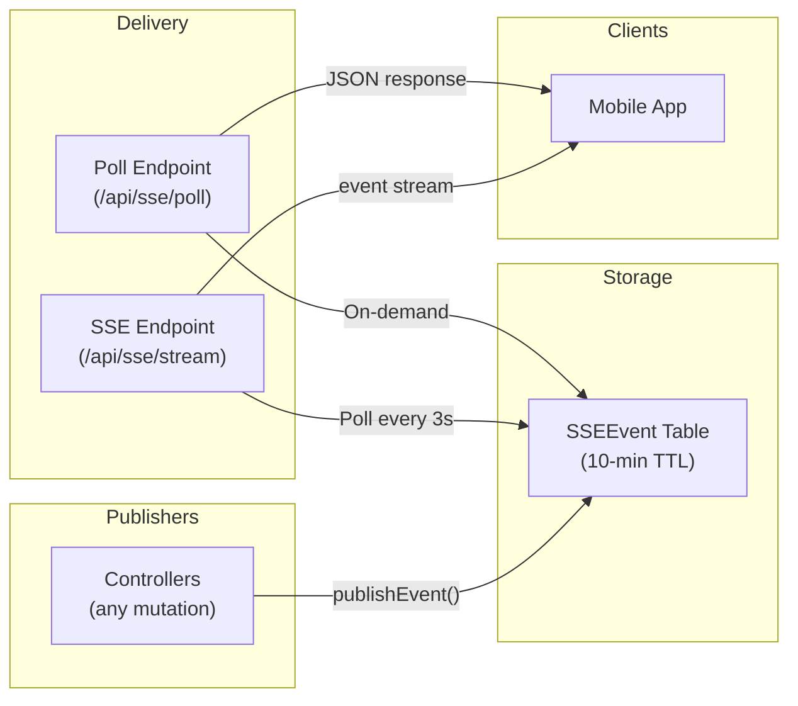

# Real-Time Events (SSE)

## Overview

DelipuCash uses Server-Sent Events (SSE) for real-time server-to-client communication. Events are stored in the `SSEEvent` database table and streamed to connected clients.

## Architecture



## Event Publishing

**File:** `server/lib/eventBus.mjs`

```javascript
// Publish to a single user (fire-and-forget)
await publishEvent(userId, 'notification.new', { id, title, body });

// Publish to multiple users
await publishEventToMany(userIds, 'reward.earned', { points, description });

// Cleanup old events (called periodically)
await cleanupOldEvents(10); // Delete events older than 10 minutes
```

Publishing never throws — errors are logged but don't crash the triggering mutation.

## SSE Stream Endpoint

**`GET /api/sse/stream`** (requires JWT)

### Connection Lifecycle

1. Client connects with `Authorization: Bearer <token>`
2. Server sets SSE headers (`Content-Type: text/event-stream`, `Cache-Control: no-cache`)
3. Server polls `SSEEvent` table every 3 seconds for new events
4. Events are sent in standard SSE format
5. Heartbeat comment (`: heartbeat`) sent every 10 seconds
6. Connection auto-closes after 25 seconds (Vercel serverless limit)
7. Client reconnects with `Last-Event-ID` header for resumption

### SSE Message Format

```text
id: 42
event: notification.new
data: {"id":"uuid","title":"Reward Earned","body":"You earned 500 points!"}

id: 43
event: payment.success
data: {"amount":5000,"provider":"MTN","reference":"TXN-123"}
```

### Resumption

The `seq` field (auto-increment) enables gap-free resumption:

```text
Client connects → Last-Event-ID: 42
Server queries → WHERE userId = ? AND seq > 42
Server sends → Events 43, 44, 45...
```

## JSON Poll Endpoint

**`GET /api/sse/poll`** (requires JWT)

Alternative for environments where SSE streams are impractical (e.g., edge function bridging):

```json
{
  "lastSeq": 45,
  "events": [
    { "type": "notification.new", "payload": { "id": "...", "title": "..." } },
    { "type": "reward.earned", "payload": { "points": 500 } }
  ]
}
```

## Event Types

| Event Type | Published By | Payload |
|-----------|-------------|---------|
| `notification.new` | notificationController | `{ id, title, body, type, priority }` |
| `payment.success` | paymentController | `{ amount, provider, reference }` |
| `payment.failed` | paymentController | `{ error, refunded }` |
| `reward.earned` | rewardQuestionController | `{ points, description }` |

## Client Integration

On the frontend, SSE is managed by `SSEManager` in `services/sse/`:

```typescript
// Hook usage
const { isConnected } = useSSE();

// Listen for specific events
eventSource.addEventListener('notification.new', (event) => {
  const data = JSON.parse(event.data);
  // Update notification count, show toast, etc.
});
```

The `SSEProvider` component in the app layout manages connection lifecycle, reconnection, and the Zustand `SSEStore` for connection status.

## Configuration

| Parameter | Value | Purpose |
|-----------|-------|---------|
| Poll interval | 3 seconds | How often stream checks for new events |
| Heartbeat | 10 seconds | Keep-alive for proxies |
| Connection TTL | 25 seconds | Vercel serverless limit |
| Event TTL | 10 minutes | Auto-cleanup of old events |
