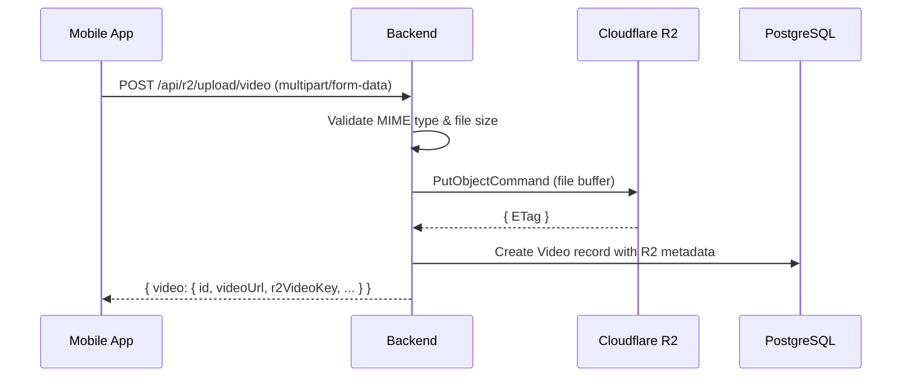
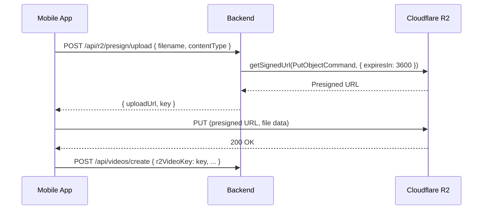

# File Storage (Cloudflare R2)

## Overview

DelipuCash uses Cloudflare R2 (S3-compatible object storage) for all media files: videos, thumbnails, livestream recordings, and ad assets. The backend provides both server-side upload and presigned URL flows.

## Configuration

**File:** `server/lib/r2.mjs`

| Env Variable | Purpose |
|-------------|---------|
| `CLOUDFLARE_ACCOUNT_ID` | Cloudflare account identifier |
| `R2_ACCESS_KEY_ID` | S3-compatible access key |
| `R2_SECRET_ACCESS_KEY` | S3-compatible secret key |
| `R2_BUCKET_NAME` | Bucket name (e.g., "delipucash") |
| `R2_PUBLIC_URL` | Optional CDN/custom domain URL |

**S3 Endpoint:** `https://{ACCOUNT_ID}.r2.cloudflarestorage.com`

## Storage Paths

| Content Type | Path Pattern | Example |
|-------------|-------------|---------|
| Videos | `videos/{userId}/{videoId}/{filename}` | `videos/abc123/def456/video.mp4` |
| Thumbnails | `thumbnails/{userId}/{videoId}/{filename}` | `thumbnails/abc123/def456/thumb.jpg` |
| Livestreams | `livestreams/{userId}/{sessionId}/{filename}` | `livestreams/abc123/sess789/recording.webm` |
| Ad Media | `ads/{userId}/{adId}/{filename}` | `ads/abc123/ad456/banner.png` |

## Upload Flows

### Server-Side Upload

Used when the file goes through the backend (e.g., video creation with metadata).



### Presigned URL Upload

Used for direct client-to-R2 uploads (reduces server bandwidth).



## File Validation

### Video Files

| Constraint | Value |
|-----------|-------|
| Allowed MIME types | video/mp4, video/quicktime, video/webm, video/x-matroska |
| Max file size | 500 MB (tier-dependent) |

### Image Files

| Constraint | Value |
|-----------|-------|
| Allowed MIME types | image/jpeg, image/png, image/webp, image/gif |
| Max file size | 5 MB |

### Tier-Based Limits

Upload limits vary by user tier (free vs premium):

| Tier | Video Size Limit | Recording Duration | Livestream Duration |
|------|-----------------|-------------------|-------------------|
| Free | ~100 MB | 60 seconds | 300 seconds |
| Premium | ~500 MB | 300 seconds | 3600 seconds |

## Metadata Tracking

Every R2 upload stores metadata in the corresponding Prisma model:

| Field | Purpose |
|-------|---------|
| `r2VideoKey` / `r2ThumbnailKey` | R2 object key for retrieval |
| `r2VideoEtag` / `r2ThumbnailEtag` | Cache validation tag |
| `videoMimeType` / `thumbnailMimeType` | Content-Type for serving |
| `videoSizeBytes` / `thumbnailSizeBytes` | File size tracking |
| `storageProvider` | Always "r2" (future-proof for multi-provider) |
| `isProcessed` / `processingStatus` | Transcoding state |

## Signed Download URLs

For private content, the backend generates time-limited download URLs:

```javascript
// Default: 1-hour expiry
const signedUrl = await getSignedUrl(s3Client, new GetObjectCommand({
  Bucket: R2_BUCKET_NAME,
  Key: objectKey,
}), { expiresIn: 3600 });
```

## API Endpoints

| Method | Path | Auth | Description |
|--------|------|------|-------------|
| POST | `/api/r2/upload/video` | JWT | Upload video file |
| POST | `/api/r2/upload/thumbnail` | JWT | Upload thumbnail image |
| POST | `/api/r2/upload/media` | JWT | Upload video + thumbnail |
| POST | `/api/r2/upload/validate` | JWT | Check upload limits |
| POST | `/api/r2/upload/ad-media` | JWT | Upload ad image/video |
| POST | `/api/r2/presign/upload` | - | Get presigned upload URL |
| POST | `/api/r2/presign/download` | - | Get presigned download URL |
| POST | `/api/r2/livestream/chunk` | - | Upload livestream chunk |
| POST | `/api/r2/livestream/finalize` | - | Finalize livestream recording |
| DELETE | `/api/r2/delete/:key(*)` | - | Delete object by key |

## Livestream Recording

Livestream recordings use chunked upload:

1. **Start:** Create `Livestream` record with status "live"
2. **During:** Upload chunks to `livestreams/{userId}/{sessionId}/chunk-{n}.webm`
3. **Finalize:** Concatenate chunks into final recording, update `r2RecordingKey`
4. **Cleanup:** Remove individual chunks after finalization
