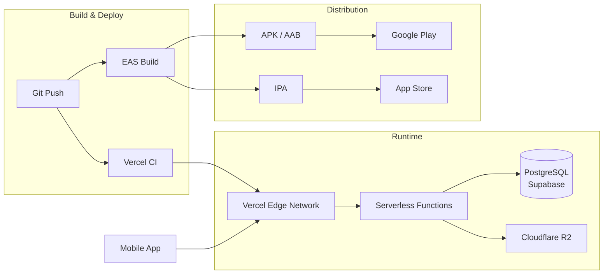

# Deployment

DelipuCash uses a split deployment model: the Express.js backend runs as Vercel Serverless Functions, while the React Native mobile app is built and distributed via EAS Build.

## Architecture



## Components

| Component | Platform | Guide |
|-----------|----------|-------|
| Backend API | Vercel Serverless | [backend-vercel.md](backend-vercel.md) |
| Mobile App | EAS Build | [frontend-eas.md](frontend-eas.md) |
| Database | Supabase (PostgreSQL) | Managed service |
| File Storage | Cloudflare R2 | S3-compatible, configured via env vars |
| Environment | All platforms | [environment-variables.md](environment-variables.md) |

## Deployment Flow

### Backend

```
git push origin main
  → Vercel detects push
  → Runs: bun install
  → Runs: bun run vercel-build (prisma migrate deploy + prisma generate)
  → Deploys api/index.js as serverless function
  → Live at https://delipucash-latest.vercel.app
```

### Frontend

```
eas build --platform android --profile production
  → EAS cloud builds APK via Gradle
  → Downloads artifact

eas build --platform ios --profile production
  → EAS cloud builds IPA via Xcode
  → Downloads artifact or submits to App Store Connect
```

## Quick Reference

| Action | Command |
|--------|---------|
| Deploy backend | `git push origin main` (auto-deploys via Vercel) |
| Build Android APK | `eas build --platform android --profile production` |
| Build iOS IPA | `eas build --platform ios --profile production` |
| Preview build (internal) | `eas build --platform android --profile preview` |
| Dev client build | `eas build --platform android --profile development` |
| Submit to stores | `eas submit --platform all` |
| Open Prisma Studio | `cd server && bun run db:studio` |
| Run migrations | `cd server && bunx prisma migrate deploy` |

## Related

- [Environment Variables](environment-variables.md) — All required env vars
- [Backend Setup](../backend/README.md) — Local development
- [Frontend Setup](../frontend/README.md) — Local development
- [Database Guide](../backend/database.md) — Migrations and seeding
